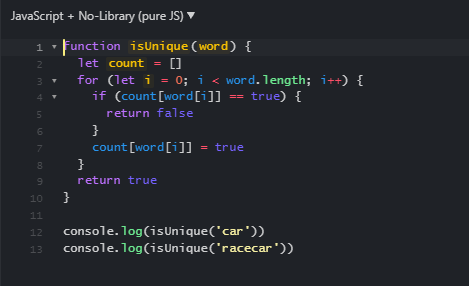

# Second Homework WOD

This is the second WOD (Workout of the day) that we had to complete for homework for ICS314 Software Engineering.  The objective of this workout was to implement an algorithm that would parse a string and figure out if all the characters in the string were unique.  Initially I wanted overthought how to approach the problem and thought about using two arrays to compare the characters.  The first array would hold the inital string and the second array would hold the characters already parsed while checking if there were duplicates.  

# Conclusion

Eventually after watching the video I realized I just needed to check the values of one array and if the value came up the same twice, that would mean there was a duplicate character.  For example, I used racecar and car as a test and found that racecar failed because 'c' is the first character to repeat.  However, 'car' passed because there are no duplicate characters.

