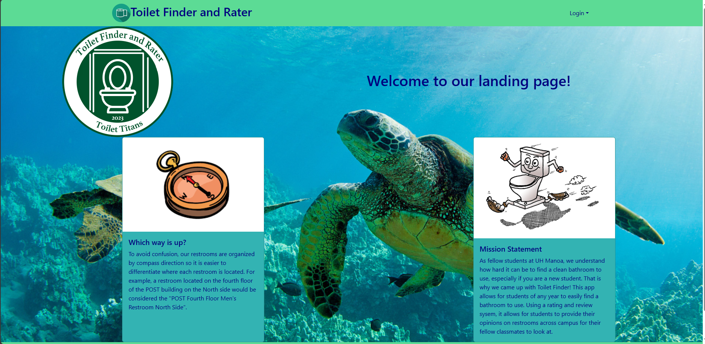
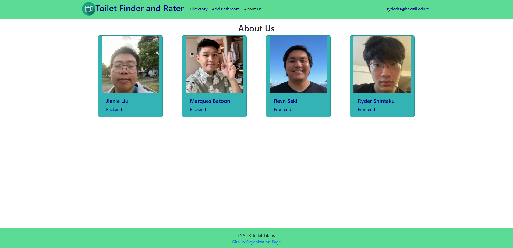
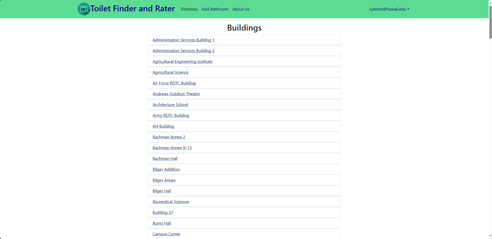

# ToiletFinder
The goal of this project was to provide the ability for fellow UH Manoa students to be able to find sanitary restrooms throughout campus.  One of the biggest hassles as students is finding restrooms that are clean enough where we are comfortable to use it.  For most students now, it takes a lot of time to figure out where the best restrooms are. But with this application, students both new and old would be able to provide information on the best restrooms to use.  This would include star-based reviews out of five and a text review.  Putting this application to use would save a lot of time because students would no longer need to search for decent restrooms just by trial and error.  

# Divide and Conquer
Since our group had four members, we were able to divide the roles relatively evenly.  Two members of the team focused on the back-end, while the other two members (myself included), focused on the front-end.  I mainly designed the homepage, navbar, and made bare bone pages for the backend to connect to when they were ready.  One of the biggest challenges for both back-end and front-end was connecting the back-end to our front-end pages.  Since it was something that we had not focused on a ton previously, it was a learning experience for most of our group members.  

# At the End...
I thought that this project was a really big learning experience for myself and one of the toughest projects I have been assigned as an ICS student.  This was the first time I took part in a group project regarding computer science so it was really eye opening on how a career in the computer science field will eventually be.  I think the biggest aspects that could have been improved on was keeping procrastination in check and having a better form of communication between the group.  Doing so would have allowed for more efficient problem solving and work progress.  
