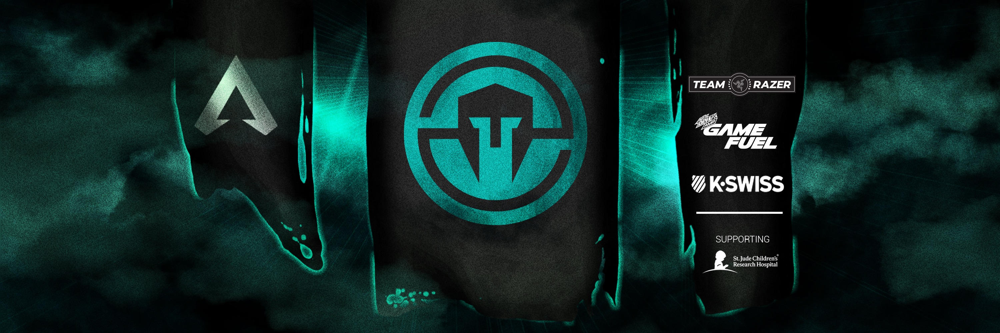
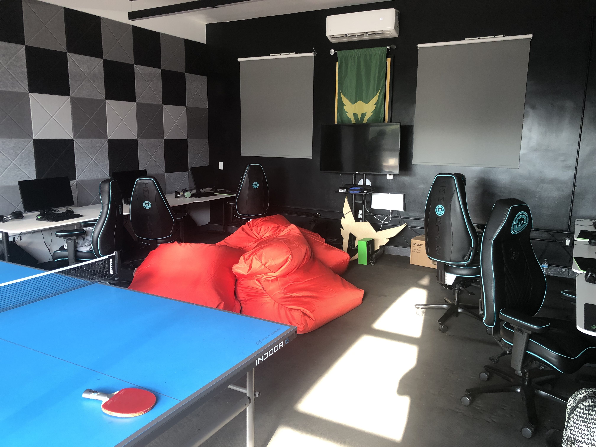

# Professional Esports Player
In 2019 I had the opportunity to play video games professionally (otherwise known as esports) for a short while.  I competed in a game known as Apex Legends for a well known team called Immortals.  They are mostly known for having a franchise spot in another esport, League of Legends.

# What I Learned
While competing professionally I learned many things.  This includes while not limited to, representing a notable brand, communicating with reputable brands, and learning how to cooperate with a team alongside critical thinking.  Some of the most important things I think are representing a notable brand and cooperating with a team.  I think representing a notable brand is important because it ties into how we portray ourselves and that we represent not only ourselves but the people we work for/with as well.  I also thought cooperating as a team is important because in computer science you are often working in a team as well so that experience transfers over. 

